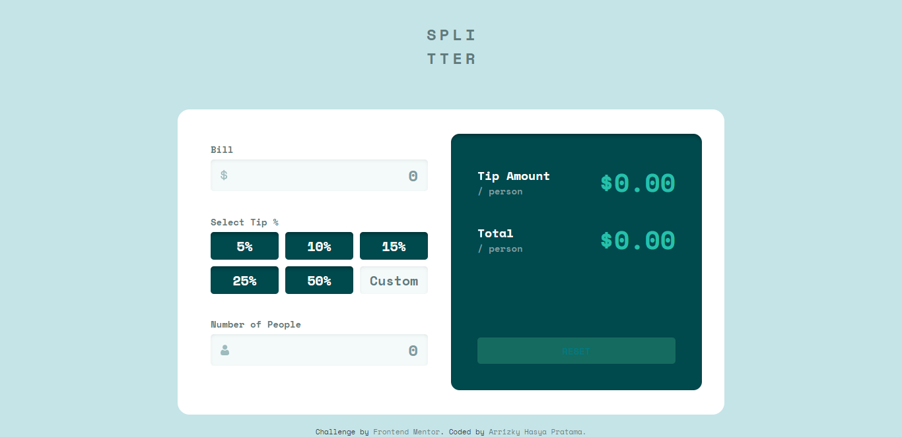

# Frontend Mentor - Tip calculator app solution

This is a solution to the [Tip calculator app challenge on Frontend Mentor](https://www.frontendmentor.io/challenges/tip-calculator-app-ugJNGbJUX). Frontend Mentor challenges help you improve your coding skills by building realistic projects.

## Table of contents

- [Overview](#overview)
  - [The challenge](#the-challenge)
  - [Screenshot](#screenshot)
  - [Links](#links)
- [My process](#my-process)
  - [Built with](#built-with)
  - [What I learned](#what-i-learned)
- [Author](#author)

## Overview

### The challenge

Users should be able to:

- View the optimal layout for the app depending on their device's screen size
- See hover states for all interactive elements on the page
- Calculate the correct tip and total cost of the bill per person

### Screenshot


[📱 Mobile Version](./mobile.png)

### Links

- 📌 Solution URL: [Solution](https://github.com/arrizkyhp/fm-tip-calculator-app)
- 🎪 Live Site URL: [Live Site](https://arrizkyhp.github.io/fm-tip-calculator-app/)

## My process

### Built with

- CSS custom properties
- Flexbox
- CSS Grid
- BEM naming
- [Sass](https://sass-lang.com/) - CSS extension
- [GulpJS](https://gulpjs.com/) - JS library
- [ReactJS](https://reactjs.org/) - JS library
- [Jest](https://jestjs.io/) - JS Test Framework
- [Enzyme](https://enzymejs.github.io/enzyme/) - JS Test Framework

### What I learned

This is my first time using Enzyme as Testing utility, At first I found it difficult to use it, but after some trial and error, I slowly enjoyed.

here's a bit of code. it should test when we fill in the input and click on the button we should get the total amount and the correct tip:

```js
it("should render correct tipAmount & total", () => {
  container
    .find("input")
    .at(0)
    .simulate("change", { target: { value: 142.55 } });
  expect(container.find("input").at(0).prop("value")).toBe(142.55);

  container.find(".btn--tip").at(2).simulate("click");

  container
    .find("input")
    .at(2)
    .simulate("change", { target: { value: 5 } });

  expect(container.find("#tipAmount").text()).toBe(`$4.28`);
  expect(container.find("#total").text()).toBe(`$32.79`);
});
```

## Author

- Github - [arrizkyhp](https://github.com/arrizkyhp)
- Frontend Mentor - [@arrizkyhp](https://www.frontendmentor.io/profile/arrizkyhp)
- Twitter - [@arrizkyhp](https://twitter.com/arrizkyhp)
